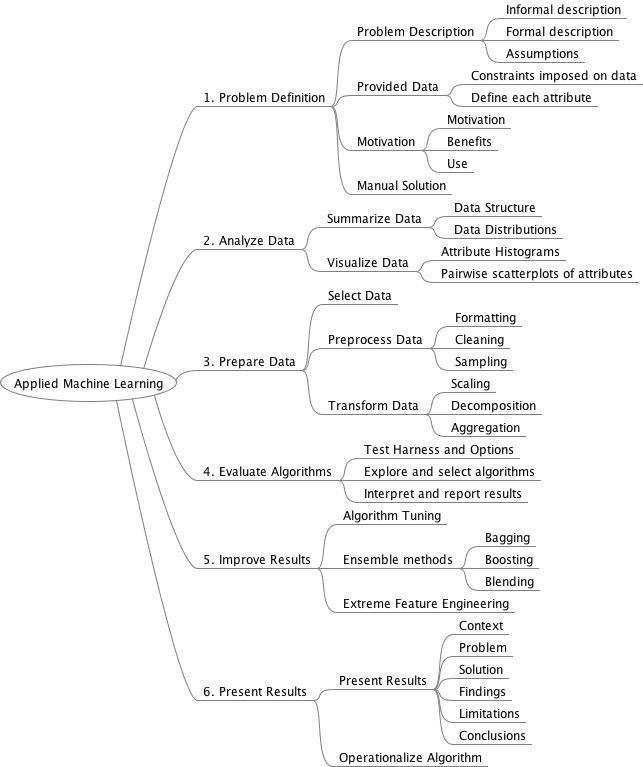

# Machine Learning

Machine Learning Process

## Contact

If you loved what you read here and feel like we can collaborate to produce some exciting stuff, or if you
just want to shoot a question, please feel free to connect with me on <a href="hello@gupta-harsh.com" target="_blank">email</a>, 
<a href="http://bit.ly/2uOIUeo" target="_blank">LinkedIn</a>, or 
<a href="http://bit.ly/2CZv1i5" target="_blank">Twitter</a>. 
My other projects can be found [here](http://bit.ly/2UlyFgC).

